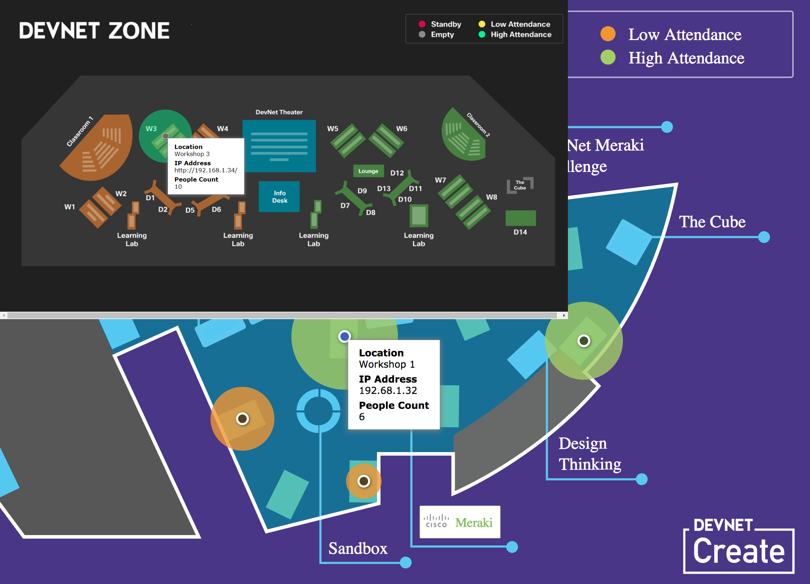

# Interactive Map example for RoomKits

This project illustrates how to create a Map that displays PeopleCount analytics fired by a set of Roomkits.

The repo should be explored in this order:
- [html](html/): static version of the map
- [react](react/): turning the static map to a React app (plain JSX, without bundling)
- [react-collector](react-collector/): becoming dynamic by injecting collected data and updating the map live
- [react-design](react-design/): a better design for the map (built for DevNet Create'18)
- [react-bundled](react-bundled/): turning the JSX main file to individual React components ([MarkerComponent](react-bundled/src/MarkerComponent.js))

Inspired by these React examples:
- [Roomie](https://bitbucket.org/bjolseth/roomie/): an end-to-end app, mobile friendly
- [PixelsWifi](https://github.com/pixels-wifi/pixels-wifi): an interactive dashboard showing affluence based on Cisco CMX Location Services
