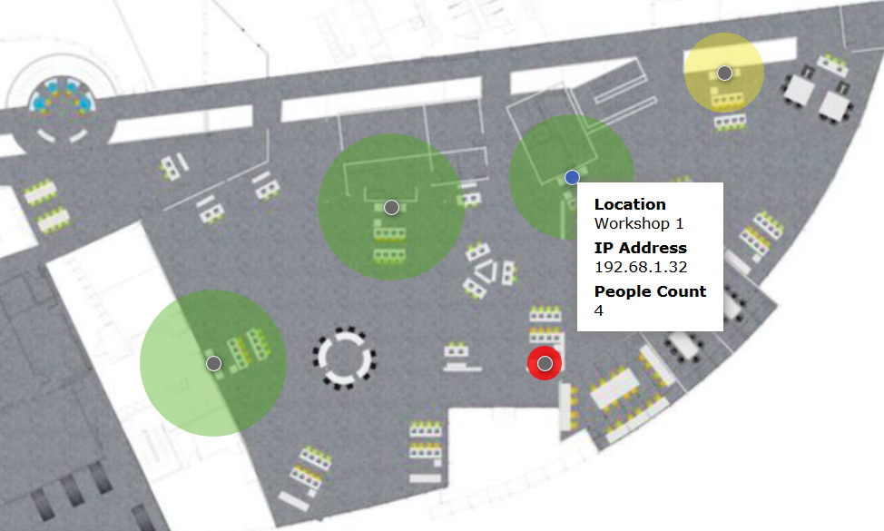

# Interactive Map example for RoomKits

This project illustrates how to create a Map that displays PeopleCount analtics returned by a set of Roomkits.

- html: static version of the map
- react: turning the static map to a React app (without bundling)
- react-collector: requesting the collector from the React map

**If you're interested for an advanced example showcasing React interacting with RoomKits, check [Roomie](https://bitbucket.org/bjolseth/roomie/)**
