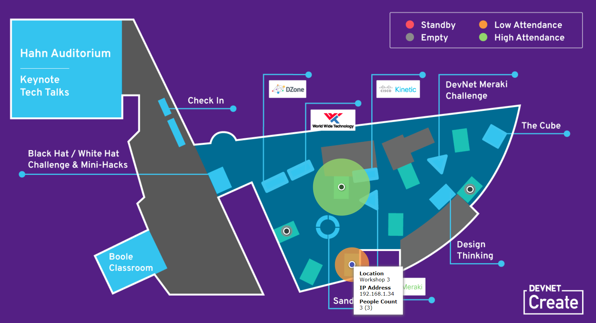

# Dynamic Map in React - no bundler

Dynamic map built with React

Updates via queries to a [RoomKit Collector](https://github.com/ObjectIsAdvantag/roomkit-collector)

Loads via polyfill (no need to use a bundler)




## Quickstart

_April 2018: note that due to React constraints with CORS, the page will open in Firefox but not in Chrome. Won't open in Internet Explorer since the fetch function is not supported._

Launch RoomKit collector Mock from a terminal

```shell
git clone https://github.com/ObjectIsAdvantag/roomkit-collector
cd roomkit-collector
cd api
npm install
node mock.js
```

Then, simply open 'main.html' in Firefox.
or serve the files from a simple HTTP Server, such as Caddy.


