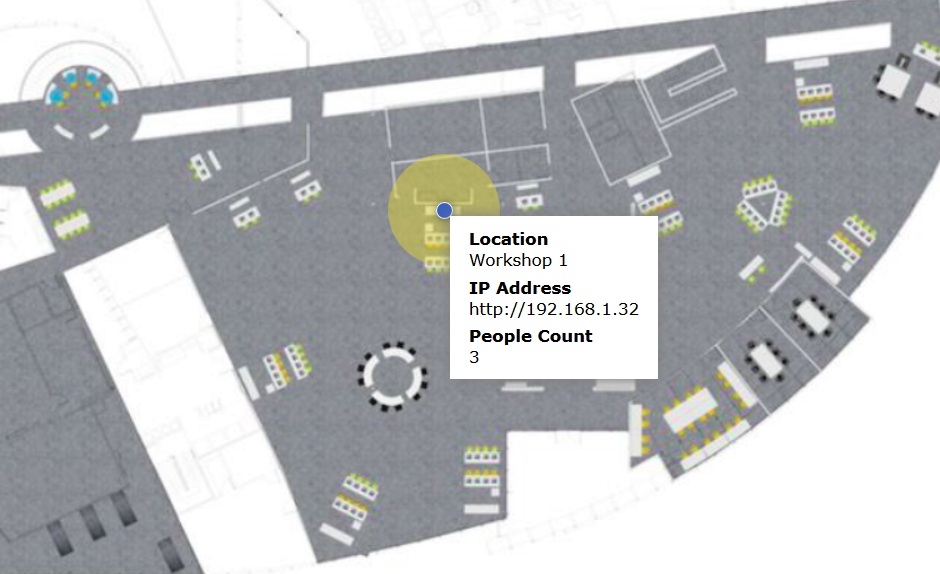

# Static Map in React - no bundler

Static map built with React

Loads via polyfill (no need to use a bundler)

## Quickstart (Firefox)

Simply open 'main.html' in Firefox.

_April 2018: note that due to React constraints with CORS, the page will open in Firefox but not in Chrome. Won't open in Internet Explorer since the fetch function is not supported._

## Quickstart (Chrome)

Serve the files from a simple HTTP Server, such as Caddy.
